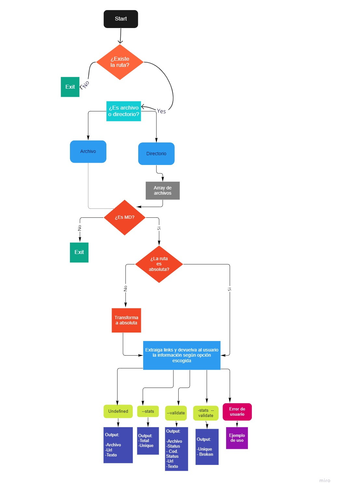
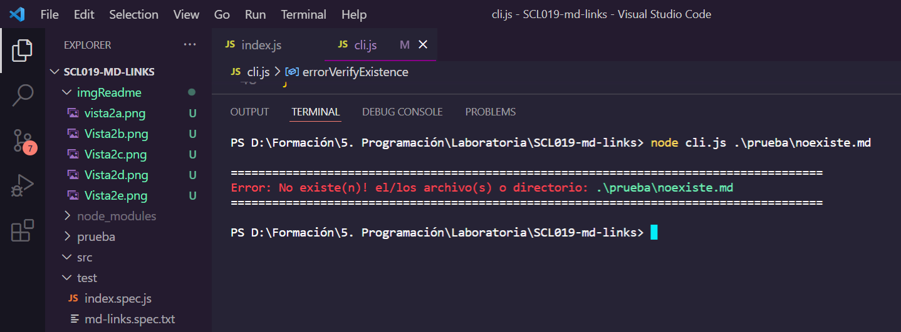
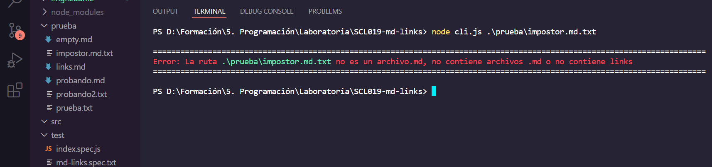

# Markdown Links

## Índice

* [1. Resumen del proyecto](#1-resumen-del-proyecto)
* [2. Diagrama de flujo](#2-diagrama-de-flujo3)
* [3. Vistas - ingreso de ruta](#3-vistas-ingreso-de-ruta)
* [4. Vistas - opciones de usuario](#4-vistas-opciones-de-usuario)
* [5. Uso e instalación](#5-uso-e-instalación)

***

## 1. Resumen del proyecto

##md-links-mo## es una librería que permite revisar links de un archivo md y obtener información general sobre ellos y su estado, a traves de las opciones:

--validate , --stats o ambas.

## 2. Diagrama de flujo

## 3. Vistas ingreso de ruta

# Error archivo inexistente:

# Error extensión distinta a md:

## 4. Vistas opciones de usuario

## 5. Uso e instalación
 
